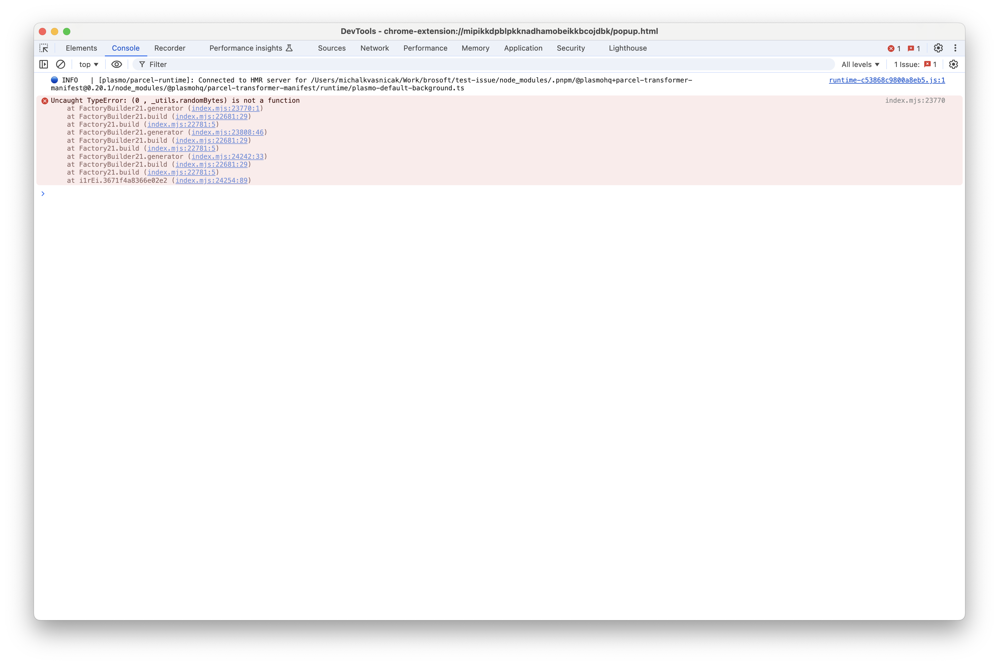

This repo contains a reproduction of a compilation bug where plasmo outputs same variable `_utils` twice with different values therefore causing the code to fail in runtime.

## Debug

Run `pnpm dev` and load unpacked extension in Chrome. Then right click on extension and run `Inspect popup` to see the console output.

